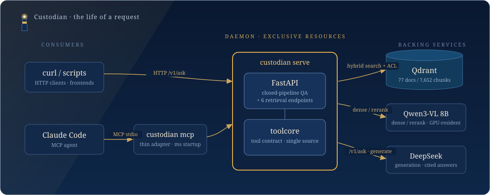

<div align="center">


# Custodian
### Fail-closed, multi-format agentic RAG for your team's documents

[](https://github.com/Laurent00TT/CustodianRAG/actions/workflows/ci.yml)
[](LICENSE)


[](docs/learning/)

**Turn PDFs, scans, docx, pptx and xlsx into a local knowledge base you can ask questions of — with enterprise access control and citations you can trace back to the page.**
Each RAG component was sharpened on its own, then folded into one repository: multi-identity auth, observability and systemd supervision come with it.

</div>

> **A note on language.** The code, CLI, comments, deep-dive documentation under `docs/`
> (including the 12-part learning series), and commit history are entirely in English.
> The system's non-English *data* language is Telugu (see [What this fork
> changed](#what-this-fork-changed) below) — that's a separate thing from what language
> the project's own text is written in.

---

> The Lighthouse of Alexandria stood beside the Library, guiding ships to shore. **Custodian does the same job, except what it lights up is your team's document library.**

This is not another chunking toy. Every significant decision here is backed by a measurement, argued through several rounds of adversarial review, and is running today over 77 real documents and 7,652 chunks. Installing it is one line: `pip install -e '.[dev]'` (src-layout, editable).

## What this fork changed

Starting from the upstream project, this fork did four things, in this order, without changing the retrieval/generation logic or the request contracts:

1. **Translated every source comment, docstring, and `docs/` page from Chinese to English** — 37 source files (~1,140 lines) plus the full `docs/` tree, including the 12-part learning series. Internal review shorthand that had accumulated in the comments (tags like `R1`–`R5`, `B3.A`, `"seal review #9"`) was rewritten as plain descriptive prose rather than carried over as opaque codes. Where a `docs/` page discusses historical numbers measured specifically against the original Chinese-language dataset (before this fork replaced Chinese-language support with Telugu — see below), the prose was translated but the measurements were left as historical record rather than silently relabeled "Telugu," with an inline note where that matters (e.g. [docs/components/embedder/DESIGN.md](docs/components/embedder/DESIGN.md)).
2. **Renamed six modules whose names didn't say what they held**, and updated every import across `src/`, `tests/`, `scripts/`, and `docs/` to match (see the table below). No public package API changed — `from chunker import Chunker`, `from embedder import Retriever`, `from generator import Generator` all still work exactly as before, because these were internal file renames, not package-interface changes.
3. **Fixed one algorithmic hot spot and one batching gap**, both verified behavior-preserving against the original before being applied (see [Optimizations](#optimizations-in-this-fork)).
4. **Reviewed the dependency stack for better alternatives** — one dependency added (a dev-only linter), nothing swapped out; see [Technology stack](#technology-stack) for the reasoning on each choice.

Everything below reflects the fork's current state. `python3 -m py_compile` was run on every changed file; the project's own `pytest` suite and the GPU `eval/acl_regression.py` regression could not be executed in the environment this work was done in (no GPU, no package registry access) — **run them yourself before trusting this in production**:

```bash
pip install -e '.[dev]'
pytest tests -q
python eval/acl_regression.py     # needs a GPU + a built index
```

### Files renamed for clarity

| Before | After | Why |
|---|---|---|
| `chunker/core.py` | `chunker/chunking.py` | "core" said nothing about what's inside (the `Chunker` class and the chunk-size budget logic); the package is already called `chunker`, so the file should name the thing it does |
| `chunker/retrieve.py` | `chunker/assembly.py` | this file doesn't retrieve anything — it's the small-to-big **assembly** logic (`assemble_big`, `_gather`, `_window_within`) that runs after a hit comes back from `embedder` |
| `embedder/retrieve.py` | `embedder/retriever.py` | one file, one class (`Retriever`); matches the existing convention in this package (`dense.py` → `Dense`, `store.py` → `Store`) |
| `generator/generate.py` | `generator/synthesis.py` | `generator.generate` read as a stutter and undersold what the module does — it's the full answer-synthesis path (prompting, LLM call, citation building, grounding checks), not a one-line wrapper |
| `custodian/obs.py` | `custodian/observability.py` | an abbreviation with no upside; nothing elsewhere in the codebase called it "obs" |
| `custodian/smart.py` | `custodian/smart_ask.py` | matches the feature's actual name everywhere else in the code and config (`cfg.smart_ask`, the `smart-ask` sections of `service.py`) — the file was the only place still calling it just "smart" |

## Optimizations in this fork

Both changes below were verified byte-identical / count-identical against the pre-change behavior using randomized equivalence tests (in `Retriever` a 200-trial run over synthetic section trees; in `Embedder` a 50-trial × 6-batch-size sweep) before being applied to the real files — there is no test harness in this sandbox capable of running the project's actual GPU/Qdrant-backed suite, so this was the verification available.

| File | Change | Effect |
|---|---|---|
| `embedder/retriever.py` — `Retriever._visible_own_sections` | Was O(S²) in section count S: rescanned every section's full child list once per section. Rewritten to group children by `parent_sec_id` once, up front. | O(S²) → O(S). Matters on any large slide deck or policy document with hundreds of sections — this method runs on every `get_document`/`get_outline` call. |
| `embedder/embed.py` — `Embedder.index_document` | Was calling `dense.encode_text([chunk])` / `encode_image([chunk])` one chunk at a time (batch size 1), despite both accepting lists. Now batches text and image chunks separately into groups of the new `EmbedConfig.embed_batch_size` (default 16). | Fewer, larger forward passes instead of one per chunk — this is where batching pays off most, since a GPU forward pass has fixed per-call overhead that a document with thousands of chunks was paying thousands of times over. |

## Technology stack

The stack was reviewed end to end for genuinely better alternatives, not replaced wholesale. Verdict on each piece:

| Component | Current choice | Verdict |
|---|---|---|
| HTTP service | FastAPI + uvicorn | **Keep.** Native OpenAPI, Pydantic validation the codebase already leans on, and the largest async Python web ecosystem. A faster alternative (Litestar) exists but buys single-digit percentage latency at the cost of a rewrite of every route and dependency — not worth it here. |
| HTTP client (MCP adapter → daemon) | httpx | **Keep.** Already the modern default (`requests` has no native async/HTTP2 support); no upgrade path needed. |
| Agent protocol | `mcp` (Anthropic's Python SDK) | **Keep.** This *is* the reference implementation of the protocol; there is no alternative to evaluate. |
| LLM client | `openai` client pointed at DeepSeek's OpenAI-compatible endpoint | **Keep, with a note.** The codebase already defines a pluggable `LLMClient` protocol (`generator/llm.py`), so swapping backends is already cheap. If this project ever needs to run several LLM backends side by side (local vLLM + DeepSeek + Claude), a router library like `litellm` would remove some hand-rolled retry/error-normalization code — worth a look then, not worth adding now for a single backend. |
| Vector store | Qdrant (embedded, upgrading to server mode) | **Keep.** Named dense+sparse vectors with native RRF fusion and payload-based ACL filtering are exactly what this system needs, and the embedded→server upgrade path is the *same client*, which the three-way branch in `Store.__init__` already exploits. Alternatives (LanceDB, Chroma) don't offer a clear win here and would cost the existing hybrid-search and ACL-filter integration work. |
| Sparse/Telugu tokenization | regex-based (`embedder/sparse.py`) | **Changed.** This fork replaced Chinese-language support with Telugu, and Telugu (unlike Chinese) is written with spaces between words, so the `jieba` word-segmenter dependency was removed outright rather than replaced with another dictionary-based segmenter. Tokenization is now a Telugu-Unicode-block regex plus the existing alphanumeric exact-match regex — no new dependency. This is a coarser approach than a real morphological analyzer (Telugu is agglutinative, so it under-splits compound words), which is a reasonable trade-off for BM25 candidate generation but is flagged here for anyone tuning sparse recall further. |
| GPU embedding/rerank serving | `transformers` + raw forward passes (`inference_server.py`), with a `vLLM`-backed alternative already scaffolded (`inference_vllm_adapter.py`) | **Recommend promoting the vLLM path to the default for production.** vLLM's continuous batching and PagedAttention give much better GPU utilization under concurrent load than serialized raw forward passes: the codebase already built this adapter but doesn't point to it as the primary path anywhere in the docs. This is a deployment/documentation recommendation, not a code change — the two paths coexist today. |
| Dev tooling | `pytest` only | **Added `ruff`** to the `dev` extra (config-only change, zero runtime impact) — one fast tool covering linting and formatting in place of hand-managing style. |

## Two exits, one set of semantics

One knowledge base, one door for each kind of consumer:

| Exit | Command | Who uses it | What it does |
|---|---|---|---|
| **HTTP API** | `custodian serve` | curl, scripts, frontends | Closed-pipeline QA: `/v1/ask` runs retrieve → grounding → DeepSeek → an answer with citations, plus six retrieval endpoints |
| **MCP** | `custodian mcp` | agents such as Claude Code | Agentic RAG: when to retrieve, how to rewrite, whether to go multi-hop — the agent decides |

Both doors share one set of semantics, held in place by two rules: the tool contract has exactly one source (`custodian/toolcore.py`, so the stdio and HTTP sides cannot drift), and identity is decided server-side (an agent cannot edit its own permissions).

## Architecture

<div align="center">

</div>

**Why a resident daemon?** Embedded Qdrant admits a single client and holds an exclusive lock, and an 8B model takes a minute or two just to load. Under the earlier stdio-direct design, every agent session spawned its own process — fighting over the lock and reloading the model each time. Custodian inverts that: the daemon owns the heavy resources, MCP shrinks to a thin HTTP adapter (`custodian/mcp_adapter.py`) that starts in milliseconds, and every session shares one already-warm backend. The trade-offs behind this are in [docs/DESIGN.md](docs/DESIGN.md).

**Module map** (post-rename; see [above](#files-renamed-for-clarity) for what changed):

```
src/
├── chunker/        parse output → Chunk[] + Section[] (chunking.py) and query-time
│                   small-to-big context assembly (assembly.py)
├── embedder/        Qwen3-VL dense (dense.py) + BM25/regex sparse (sparse.py) → Qdrant
│                   hybrid search (store.py), ACL filtering (acl.py), and the
│                   Retriever facade (retriever.py) that ties it together
├── generator/       prompt construction (prompt.py) → LLM call (llm.py) → cited,
│                   grounded answer (synthesis.py)
├── custodian/          CLI (cli.py), HTTP daemon (service.py), MCP stdio server
│                   (mcp_stdio.py) and thin HTTP adapter (mcp_adapter.py), the
│                   shared tool contract (toolcore.py), identity/ACL binding
│                   (identity.py), observability (observability.py), and the
│                   smart-ask failure-driven retry layer (smart_ask.py)
└── inference_vllm_adapter.py   standalone vLLM-backed GPU serving alternative
                    to embedder/inference_server.py (see Technology stack above)
```

<details>
<summary><b>Production shape: from one box to three independently scalable tiers</b></summary>

<br/>

The single-node problem is that the GPU model, embedded Qdrant and application logic all live in one process, so horizontal scaling hits a ceiling immediately. Split apart, there are three tiers that scale independently:

- **`inference`** (FastAPI on `:8900`) — GPU forward passes lifted out on their own, returning full-width vectors that the client then truncates, with both sides kept equivalent;
- **`custodian`** — the application layer sheds torch entirely (set `inference_url` and it never loads a model), which is what makes `--scale custodian=N` possible;
- **Qdrant in server mode** — replicas share one source of truth, with `nginx` in front for load balancing; `docker kill` on any replica goes unnoticed.

```bash
docker compose --env-file .env.compose up -d --scale custodian=3   # entry point: http://127.0.0.1:8080
```

One thing worth stating plainly: **the throughput ceiling is the forward speed of a single inference card (the GPU serialises), and adding replicas does not raise it.** What replicas actually buy you is concurrency in the non-GPU parts, plus crash isolation and rolling upgrades. The full write-up is in [docs/SCALE_OUT.md](docs/SCALE_OUT.md).

</details>

## Repository structure

```
Custodian-RAG/
├── src/                          # the installed package (pip install -e .)
│   ├── chunker/                  # parse output → Chunk[]/Section[], query-time assembly
│   │   ├── adapters/             # per-format adapters (MinerU/PDF, docx, pptx)
│   │   ├── chunking.py
│   │   ├── assembly.py
│   │   ├── table_chunker.py
│   │   ├── meta.py
│   │   └── types.py
│   ├── embedder/                 # dense + sparse embedding, Qdrant hybrid search, ACL
│   │   ├── dense.py              # Qwen3-VL dense embeddings
│   │   ├── sparse.py             # BM25: Telugu-script + alphanumeric regex tokenizer
│   │   ├── store.py              # Qdrant collection / hybrid search / ACL filter push-down
│   │   ├── retriever.py          # public Retriever facade
│   │   ├── rerank.py
│   │   ├── acl.py
│   │   ├── remote.py             # HTTP client to a split-out inference server
│   │   ├── inference_server.py   # FastAPI GPU forward-pass server (split-tier deployment)
│   │   ├── config.py / errors.py / types.py
│   ├── generator/                # prompt construction → LLM call → grounded, cited answer
│   │   ├── prompt.py
│   │   ├── llm.py
│   │   ├── signals.py            # numeric-hint / refusal-phrase detection (en + Telugu)
│   │   ├── synthesis.py
│   │   └── types.py
│   ├── custodian/                # CLI, HTTP daemon, MCP server, shared tool contract
│   │   ├── cli.py
│   │   ├── service.py            # HTTP daemon (`custodian serve`)
│   │   ├── mcp_stdio.py          # MCP stdio server (`custodian mcp`)
│   │   ├── mcp_adapter.py        # thin HTTP adapter used by mcp_stdio
│   │   ├── toolcore.py           # single source of truth for the tool contract
│   │   ├── identity.py           # identity/ACL binding (server-side only)
│   │   ├── indexer.py            # ingest pipeline glue + detect_lang()
│   │   ├── parser.py / engine.py / sessions.py
│   │   ├── observability.py
│   │   └── smart_ask.py          # failure-driven retry/hint layer
│   └── inference_vllm_adapter.py # standalone vLLM-backed GPU serving alternative
│
├── tests/                        # pytest suite (mirrors src/ layout under tests/engine/)
│   ├── engine/
│   │   ├── fixtures/
│   │   └── test_*.py
│   └── test_*.py
│
├── eval/                         # retrieval/generation quality evaluation harness
│   ├── component_chunking/
│   ├── component_retrieval/      # BM25 vs BGE-M3 vs hybrid; queries_exact/semantic.jsonl
│   ├── gen_gold.py / gen_gold_tables.py   # gold Q&A generation (DeepSeek)
│   ├── run_eval.py / aggregate.py / acl_regression.py
│   └── index_eval_corpus.py
│
├── scripts/                      # one-off / operational scripts (sampling, benchmarking, migration)
├── config/                       # small cached/config artifacts (e.g. page-count cache)
├── deploy/                       # nginx.conf for the multi-replica production shape
├── docs/                         # design docs, ops runbooks, and the 12-part learning series
│   ├── components/               # per-component design docs (chunker/embedder/generator)
│   ├── learning/                 # RAG learning/interview-prep series
│   ├── methodology/
│   ├── archive/
│   └── assets/                   # architecture diagrams
│
├── .github/workflows/ci.yml
├── pyproject.toml                # package metadata + dependencies
├── docker-compose.yml            # multi-replica production shape (custodian + Qdrant + nginx)
├── Dockerfile.custodian / Dockerfile.inference / Dockerfile.inference-vllm
├── conftest.py
├── .env.example / .env.compose.example / .mcp.json.example
└── README.md
```

Generated/local artifacts (`corpus/`, `parsed/`, `chunks*/`, `*.keys.json`, `.env`, `.pytest_cache/`, eval gold/baseline files, etc.) are excluded via [.gitignore](.gitignore) — they're either regeneratable or environment-specific and don't belong in version control.

## Getting started

The service runs under systemd — starts at boot, restarts on failure. Day to day, a team member needs their own API key and then:

```bash
conda activate custodian
pip install -e '.[dev]'                        # src-layout, editable install

python -m custodian ask "What do we have on X?"   # closed-pipeline QA, answers carry citations
python -m custodian health
```

For agentic mode in Claude Code: copy `.mcp.json.example` to `.mcp.json` (gitignored), fill in your `CUSTODIAN_API_KEY` and local paths, and you get the `rag` tool — provided the daemon is running. With no daemon around, `custodian mcp --direct` also works: it talks stdio, loads the GPU model itself, and depends on nothing resident.

Building the index, as an administrator (the corpus is a directory of MinerU parse output):

```bash
sudo systemctl stop custodian                                     # single-client lock, so stop first
python -m custodian index --corpus <parsed_dir> --dest ~/rag_real
sudo systemctl start custodian
```

## Want to understand RAG, not just use it?

The repository also carries a **[RAG learning and interview-prep set](docs/learning/)**: this system — repeatedly contradicted by its own data and repeatedly fixed — taken apart into **12 pieces and 4,122 lines** of tutorial. It runs from chunking, hybrid retrieval, the permission model and generation grounding all the way through agentic use, evaluation methodology and multi-replica scale-out. Every piece carries code anchors, measured numbers, interview framings, and experiments you can run yourself. Translated from the original Chinese to English by this fork (see [What this fork changed](#what-this-fork-changed)).

| What you want | Which pieces |
|---|---|
| The trade-off at each RAG layer, and what the mainstream options look like | [01 overview](docs/learning/01-rag-overview.md) · [02 chunking](docs/learning/02-parsing-chunking.md) · [03 retrieval](docs/learning/03-retrieval.md) |
| Enterprise permissions, generation grounding, agentic | [04 ACL](docs/learning/04-acl-security.md) · [05 generation](docs/learning/05-generation-grounding.md) · [06 agentic](docs/learning/06-agentic-mcp.md) |
| How RAG should actually be evaluated (where this system spent the most care) | [07 evaluation](docs/learning/07-evaluation.md) |
| System design, single box to replicas, engineering method | [08 service](docs/learning/08-service-architecture.md) · [09 scale-out](docs/learning/09-scale-out.md) · [10 stories](docs/learning/10-methodology-stories.md) |
| Interview cramming | [11 question bank](docs/learning/11-interview-qa.md) |

## Security model

- **Identity answers "who is asking", ACL answers "what may they see".** An X-API-Key resolves to an identity first; that identity's tenant and principals are then handed to the retrieval layer per request, where ACL does hard filtering to enforce visibility. The whole chain is verified by the five-user matrix in `acl_regression`.
- **Fail-closed throughout.** An unrecognised or absent key is a 401. A malformed keys file refuses to start. Binding to a non-loopback address forces keys mode — the library does not go out on the LAN unguarded. A document with no permissions attached is visible to nobody by default.
- **Sessions are isolated from each other.** Cross-call deduplication is bucketed by identity and session, so one person never sees another's state. **It also does not leak detail:** logs record identity names and never keys, errors do not spill internals, and every retrieved passage is tagged `trust: untrusted` against prompt injection.
- Binds `127.0.0.1` only by default. HTTPS and public exposure are explicit non-goals — tunnel in if you need remote access.

<details>
<summary><b>Three identity modes, and the configuration</b></summary>

<br/>

| Mode | Trigger | Used for | Where identity comes from |
|---|---|---|---|
| **keys** | `CUSTODIAN_KEYS_FILE` is set | **team deployment (default)** | each request's X-API-Key yields its own identity (name + tenant + principals) |
| **legacy** | only `CUSTODIAN_API_KEY` is set | single user, or just a doorstop | one key, identity bound at startup |
| **open** | neither is set | local development, loopback only | the single identity bound at startup |

```bash
python -m custodian keys new alice --tenant demo --admin      # issue an identity; the key prints exactly once
python -m custodian keys new bob   --tenant demo --principals g_eng
# set CUSTODIAN_KEYS_FILE=~/custodian.keys.json in .env; add CUSTODIAN_HOST=0.0.0.0 for LAN access
sudo systemctl restart custodian
```

Configuration lives in the single `.env` at the repository root (see [.env.example](.env.example); everything is prefixed `CUSTODIAN_*`): `CUSTODIAN_KEYS_FILE`, `CUSTODIAN_CORPUS_DIR`, `CUSTODIAN_INDEX_DIR` (defaults to `~/rag_real`), `CUSTODIAN_COLLECTION`, `CUSTODIAN_PORT` (8787), `CUSTODIAN_HOST` (a non-loopback bind forces keys mode), `CUSTODIAN_LOG_DIR`, and `DEEPSEEK_API_KEY` (needed by `/v1/ask`). The full deployment, key and operations procedures are in [docs/OPERATIONS.md](docs/OPERATIONS.md).

</details>

## Tests

```bash
python -m pytest tests -q                          # full CPU suite: product layer + engine layer, ACL predicates included
python -m pytest tests -q --ignore=tests/engine    # product layer only (fake retriever + MockLLM; no GPU, no network)
```

Neither touches a GPU, a Qdrant server or the network, and [CI](.github/workflows/ci.yml) runs them on every push. The suite size, its product/engine split and the measurement provenance live in [docs/TESTING.md](docs/TESTING.md) §1 — the single authority for that number. The GPU end-to-end zero-leak regression (`eval/acl_regression.py`, on WSL + a 4090), concurrency benchmarks, backup drills and security review records are in the same document.

> This fork's changes were verified by `py_compile` and standalone randomized equivalence tests (see [Optimizations](#optimizations-in-this-fork)); the commands above were **not** run in the environment this fork was produced in (no GPU, no package registry access) and should be run before deploying.

## Documentation index

This documentation reflects the pre-fork module names in a few places (the file renames above haven't been propagated into `docs/` yet — the code itself is the source of truth).

| Document | What it covers |
|---|---|
| [docs/OVERVIEW.md](docs/OVERVIEW.md) | **System overview (the authoritative entry point)**: the whole picture, component map, how to read this documentation set |
| [docs/learning/](docs/learning/) | **RAG learning and interview docs (12 pieces)**: chunking through evaluation, with code anchors and interview framings |
| [docs/DESIGN.md](docs/DESIGN.md) | Goals, architecture, key decisions (including the alternatives that were rejected), multi-identity and observability, risks |
| [docs/IMPLEMENTATION.md](docs/IMPLEMENTATION.md) | Module map, request paths, lock model, the retrieval-layer seam |
| [docs/API.md](docs/API.md) | HTTP API contract: endpoints, parameters, auth, the status state machine |
| [docs/OPERATIONS.md](docs/OPERATIONS.md) | **Team operations manual**: deployment, keys, measured capacity, backup and restore, troubleshooting |
| [docs/SCALE_OUT.md](docs/SCALE_OUT.md) | One box to many replicas (phases A–F): the three-tier split, load balancing, equivalence verification |
| [docs/TESTING.md](docs/TESTING.md) | Test matrix and the evidence behind it: unit tests, ACL regression, GPU smoke, benchmarks, drills, security |
| [docs/ROADMAP.md](docs/ROADMAP.md) | Where this is going, and what is **explicitly not being built** (with reasons) |
| [docs/COMPONENT_NOTES.md](docs/COMPONENT_NOTES.md) · [docs/PROVENANCE.md](docs/PROVENANCE.md) | Recorded objections to inherited components; provenance and where measurement baselines break |

Component-level design and evaluation live in [docs/components/](docs/components/) (chunker / embedder / generator / mcp-server); methodology in [docs/methodology/](docs/methodology/).

## License

[MIT](LICENSE).

<div align="center">
<br/>
<sub>Custodian · a self-built multi-format agentic RAG · local 4090 / WSL <code>custodian</code></sub>
</div>
